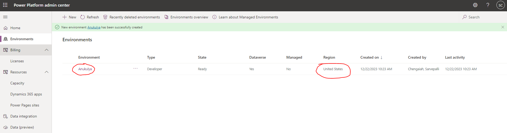
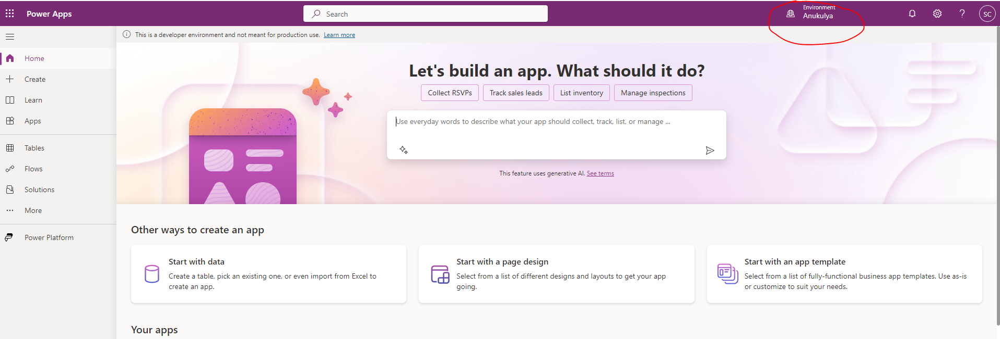

# Introduction

In the below section, we capture the activities performed on the Microsoft power platform leveraging AI Copilot.

# Pre-requisities

As per the pre-requisites indicated [here](https://github.com/MicrosoftDocs/powerapps-docs/blob/main/powerapps-docs/maker/canvas-apps/ai-overview.md#prerequisites-for-the-ai-features-in-power-apps)

We have launched the [Admin center](https://admin.powerplatform.microsoft.com/) and created an environment as indicated in the pre-requisite to leverage AI Copilot feature.

Select the created environment and start creating magical apps with AI 😀

# Exploration

We have explored certain aspects by issuing prompts as indicated in the documentation [below](../README.md).

Can leverage these features when encountering use cases that can be potentially addressed with these set of tools.
